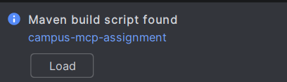
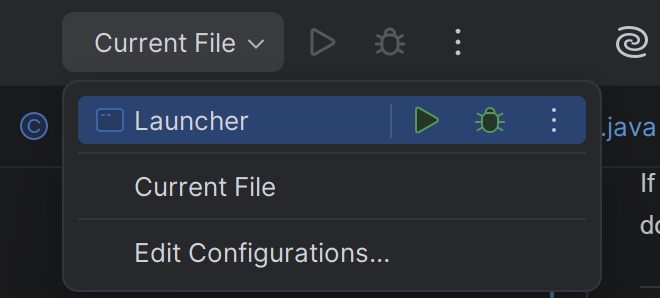

# Campus Resource Booking Companion

---

## Team Members

This project was developed by:

### Group 14
1. Leong Song Kent
2. See Qui Ven
3. Lau Ern Ling
4. Lean Wen Xi
5. Hoo Tyng En 

---

## Overview

This project is a JavaFX desktop application built using the Model Context Protocol (MCP). It lets students browse campus resources, book rooms or facilities and ask an AI assistant questions about campus policies.

The app has two main parts: an MCP server that handles all the backend stuff like bookings and resources and a JavaFX client that gives users a nice graphical interface to interact with.

Since the assignment said no Spring, Quarkus, or databases, everything is stored in plain text files instead.


## Project Structure

The project is split into two Maven modules:

**campus-info-mcp-server** – This is the backend. It runs the MCP server, manages bookings, tools, resources and stores all the data.

**reference-javafx-client** – This is the frontend. It's the JavaFX app that users actually see and interact with. It talks to the server to get things done.

---

## What You Need

Before running this, make sure you have:

- Java JDK 25
- Apache Maven 3.9 or newer
- IntelliJ IDEA (optional but recommended)

You will also need an **Anthropic API Key** if you want to use the AI assistant feature.

---

## Important First Step After Extracting

After you extract the ZIP file and open the project in IntelliJ, **you must load the Maven dependencies first** before running anything.

When you open the project, look at the bottom right or top right corner of IntelliJ. You will see a popup or a button that says **"Load"** with a **Load** button. **Click Load** and wait for IntelliJ to finish downloading all the dependencies.



---

## Method 1 – Running with IntelliJ IDEA

This is the easiest way to get things running.

---

### Step 1: Open the Project

1. Launch IntelliJ IDEA.
2. Click **Open** and select the project folder.
3. When IntelliJ opens, **click the Load button** when it appears (usually at the top right or bottom right) to load the Maven dependencies. Wait for it to finish completely.

---

### Step 2: Set Up the Project SDK

1. Go to **File → Project Structure**.
2. Under **Project SDK**, pick **JDK 25**.
3. Click **Apply** and **OK**.

---

### Step 3: Set Up the JavaFX Client Run Configuration

1. At the top right, click the dropdown next to the Run button and select **Edit Configurations**
2. Click the **+** and choose **Application**.
3. Fill in the details:
   - **Name:** `Launcher` as shown in figure below:

     

   - **Module:** `reference-javafx-client`
   - **Main Class:** `Launcher`
   - **JDK:** `JDK 25`

---

### Step 4: Add Your API Key

In the same Run Configuration window, find **Environment Variables** and add:

```
ANTHROPIC_API_KEY=your_api_key_here
```

Just replace `your_api_key_here` with your actual Anthropic API key. Click **Apply** and **OK** when done.

---

### Step 5: Start the MCP Server

There are two ways to do this:

**Option A – Click the Run Button in IntelliJ:**

1. In the Project Explorer, go to:
   ```
   campus-info-mcp-server → src → main → java → com.campus.mcp → McpServer
   ```
2. Right-click on **McpServer.java** and click the Run button.

**Option B – Use the Terminal:**

1. Open the terminal in IntelliJ.
2. Run this command:

```bash
java -jar campus-info-mcp-server/target/campus-info-mcp-server.jar
```

If everything starts up properly, you will see something like:

```
SSE Endpoint: http://localhost:8080/sse
Message POST: http://localhost:8080/mcp/message
```

Keep this running in the background.

---

### Step 6: Launch the JavaFX Client

Now just select the **Launcher** configuration you made earlier and click the Run button.

The client should automatically find the server and connect to it.

---

## Method 2 – Running from the Terminal (Windows)

If you prefer using the command line, here is how to do it.

---

### Step 1: Open PowerShell

Open Windows PowerShell.

---

### Step 2: Go to the Project Folder

Navigate to where you extracted the project. For example, if it is in Downloads:

```powershell
cd C:\Users\%USERNAME%\Downloads
cd campus-mcp-doraebyte-final
```

Sometimes the ZIP extracts into a folder with the same name inside, so you might need to go one level deeper:

```powershell
cd campus-mcp-doraebyte-final
```

---

### Step 3: Check You Are in the Right Place

Run:

```powershell
dir
```

You should see these files and folders:

```
campus-info-mcp-server
reference-javafx-client
pom.xml
README.md
```

If you see `pom.xml`, you are good to go.

---

### Step 4: Build the Project

**This is the most important step.** Run:

```powershell
mvn clean package
```

This will download all the dependencies and build both modules. It might take a while to finish. **Do not skip this step.**

---

### Step 5: Start the MCP Server

Run:

```powershell
java -jar campus-info-mcp-server/target/campus-info-mcp-server.jar
```

If it works, you will see:

```
Campus Information MCP server is running:
SSE stream: http://localhost:8080/sse
Message POST: http://localhost:8080/mcp/message
```

**Keep this PowerShell window open**

---

### Step 6: Open Another PowerShell Window

Open a second PowerShell window and go back to the project folder:

```powershell
cd C:\Users\%USERNAME%\Downloads
cd campus-mcp-doraebyte-final
```

If you had to go into a nested folder earlier, do the same here:

```powershell
cd campus-mcp-doraebyte-final
```

---

### Step 7: Go into the Client Module

```powershell
cd reference-javafx-client
```

---

### Step 8: Set Your API Key

Run this command (replace `YOUR_API_KEY_HERE` with your actual key):

```powershell
$env:ANTHROPIC_API_KEY="YOUR_API_KEY_HERE"
```

---

### Step 9: Start the Client

```powershell
mvn compile javafx:run
```

The JavaFX window should pop up after a few seconds.

Once the client loads, it will connect to the server automatically. You can log in and start using the app.

---

## Using the Application

Once everything is running, here is what you can do:

- Log in with your student ID
- Browse through the available campus resources
- Search for specific rooms or facilities
- Make new bookings
- Check your booking history
- Cancel bookings if you change your mind
- Ask the AI assistant questions about campus stuff

---

## How Data is Stored

No database was used for this project (as per the assignment requirements). Instead, all data is saved in plain text files:

- Student accounts
- Booking records
- Resource information
- Knowledge base for the AI

The server automatically updates these files whenever something changes in the app.

---

## A Few Important Notes

- Always start the MCP server before launching the client
- Make sure you are using **JDK 25**
- You need an **Anthropic API Key** for the AI assistant to work
- Double-check that you are in the right folder before running any Maven commands (you should see `pom.xml`)
- This project follows the assignment spec: Java, JavaFX, Maven, MCP, HTTP/SSE and plain text files - no Spring, Quarkus, or databases